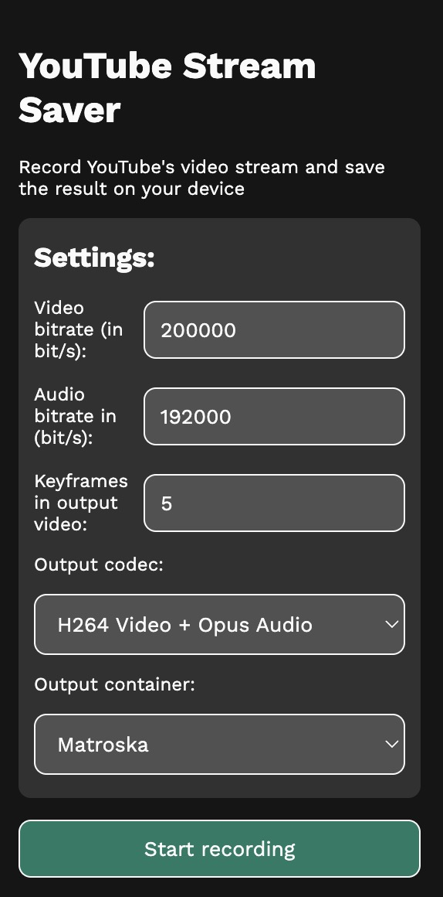

# youtube-stream-saver

Record parts of a YouTube video using the MediaRecorder API

## Installation

First, download the
[.zip file](https://codeload.github.com/Dinoosauro/youtube-stream-saver/zip/refs/heads/main)
of this repository. Then, follow the instructions for your browser.

### Chromium:

Go to the `chrome://extensions` page, and enable the `Developer mode` slider.
Extract the .zip file, and then on your browser click on the
`Load unpacked extension` button. Choose the directory where you've extracted
the .zip file, and the extension will be installed.

### Firefox

Go to `about:debugging#/runtime/this-firefox`, and click on the
`Load Temporary Add-on` button. Choose the .zip file, and the extension will be
installed.

## Usage

Click on the extension icon to open it. Then, you'll be able to choose the
codecs for the recording. You can adjust the bitrate and the interval of the key
frames, and finally you can start the recording. You can stop it at any time,
but it'll be automatically stopped:

- When the video ends
- When the quality of the video is changed (or when an advertisement starts)

**Note: The video bitrate won't be accurate, and probably the MediaRecorder
encoder will go over that.**

